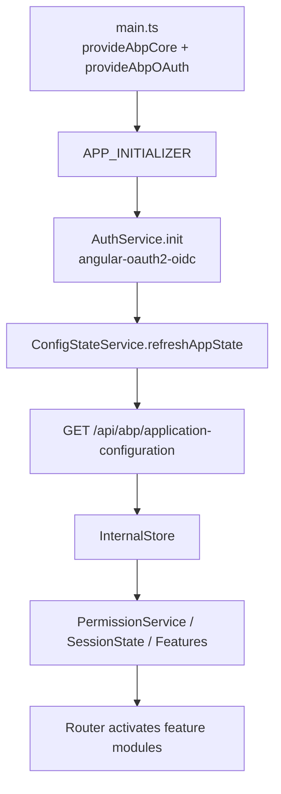

`@abp/ng.core` (`npm/ng-packs/packages/core/`) is the foundation every other `@abp/ng.*` package depends on. It loads application configuration, owns the authenticated REST pipeline, exposes state services, and ships the generated proxy types that talk to the ABP backend.

## Source layout

```
packages/core/src/lib/
├── abstracts/          # IAuthService, AuthGuard, auth response model, NgModelComponent
├── clients/            # ExternalHttpClient
├── components/         # core directives/components (replaceable, lazy-route)
├── core.module.ts      # NgModule + provideAbp() function
├── directives/
├── guards/             # PermissionGuard
├── handlers/
├── interceptors/       # api.interceptor, timezone.interceptor, transfer-state.interceptor
├── localization.module.ts
├── models/             # ABP, Rest, Environment, Session, Auth, Localization DTOs
├── pipes/
├── proxy/              # GENERATED service proxies (volo/abp/*, pages/abp/*)
├── providers/          # provideAbpCore configurators
├── services/           # all DI singletons (see below)
├── strategies/         # content-projection, DOM, security strategies
├── tokens/             # InjectionTokens (CORE_OPTIONS, TENANT_KEY, …)
└── validators/         # reactive-form validators (age, range, url, username, …)
```

## ConfigStateService — the single source of truth

`services/config-state.service.ts` holds the entire result of `/api/abp/application-configuration` in an internal store and exposes it to the rest of the app.

```typescript
@Injectable({ providedIn: 'root' })
export class ConfigStateService {
  private abpConfigService = inject(AbpApplicationConfigurationService);
  private abpApplicationLocalizationService = inject(AbpApplicationLocalizationService);
  private environmentService = inject(EnvironmentService);

  private readonly store = new InternalStore({} as ApplicationConfigurationDto);

  setState(config: ApplicationConfigurationDto) { this.store.set(config); }

  // exposes refreshAppState(), getDeep$, getSetting$, getOne, getAll$, getFeature$, …
}
```

It calls `AbpApplicationConfigurationService.get({ includeLocalizationResources })` (auto-generated proxy) on init and on every `refreshAppState()`, then merges in localization resources fetched separately by `AbpApplicationLocalizationService`. Everything downstream — `PermissionService`, `MultiTenancyService`, the `SessionStateService`, the layout — slices off this one store.

The DTO shape lives at `proxy/volo/abp/asp-net-core/mvc/application-configurations/models.ts` (`ApplicationConfigurationDto`, `ApplicationFeatureConfigurationDto`, `ApplicationGlobalFeatureConfigurationDto`).

## RestService — typed HTTP

`services/rest.service.ts` wraps `HttpClient`, resolves the right base URL from `EnvironmentService`, normalizes slashes, sets accept headers, and reports errors:

```typescript
@Injectable({ providedIn: 'root' })
export class RestService {
  protected options = inject<ABP.Root>(CORE_OPTIONS);
  protected http = inject(HttpClient);
  protected externalHttp = inject(ExternalHttpClient);   // bypasses ABP interceptor
  protected environment = inject(EnvironmentService);
  protected httpErrorReporter = inject(HttpErrorReporterService);

  request<T, R>(request: HttpRequest<T> | Rest.Request<T>, config?: Rest.Config, api?: string)
    : Observable<R> {
    api = api || this.getApiFromStore(config?.apiName);
    const url = this.removeDuplicateSlashes(api + request.url);
    // … sets observe/responseType, handles errors via httpErrorReporter
  }
}
```

Every generated proxy service ultimately routes through `RestService.request` — that is why a single `EnvironmentService.setState({ apis: { default: { url } } })` rebases the whole app.

## EnvironmentService

`services/environment.service.ts` is a tiny store of the runtime `Environment` (APIs, OAuth config, application info). It powers multi-API setups via a keyed map:

```typescript
getApiUrl(key: string | undefined) {
  return mapToApiUrl(key)(this.store.state?.apis);   // falls back to apis.default.url
}
getIssuer() {
  const issuer = this.store.state?.oAuthConfig?.issuer;
  return issuer?.endsWith('/') ? issuer : issuer + '/';
}
```

Apps populate it once at bootstrap (typically from `environment.ts`) via `provideAbpCore({ environment })`.

## AuthService — abstract by design

`abstracts/auth.service.ts` is an injectable **abstract** with stub methods that log a console error telling you to install `@abp/ng.oauth` or write your own:

```typescript
@Injectable({ providedIn: 'root' })
export class AuthService implements IAuthService {
  private warningMessage() {
    console.error('You should add @abp/ng-oauth packages or create your own auth packages.');
  }
  init(): Promise<any>            { this.warningMessage(); return Promise.resolve(); }
  login(params: LoginParams)      { this.warningMessage(); return of(undefined); }
  logout(queryParams?: Params)    { this.warningMessage(); return of(undefined); }
  get isAuthenticated(): boolean  { this.warningMessage(); return false; }
  loginUsingGrant(grantType, parameters, headers?) { /* throws not implemented */ }
}
```

`@abp/ng.oauth` re-binds the same `AuthService` DI token to `AbpOAuthService`, which wraps `angular-oauth2-oidc`. See [oauth](/ng-packs/oauth).

## HTTP interceptors

`interceptors/`:

- **`api.interceptor.ts`** — `ApiInterceptor` (used as base by `@abp/ng.oauth`): tracks in-flight requests via `HttpWaitService.addRequest`/`deleteRequest` so the loading bar knows when the app is idle. It also exposes `getAdditionalHeaders(existingHeaders)` for subclasses to inject `Authorization`, `__tenant`, culture, etc.
- **`timezone.interceptor.ts`** — appends the current timezone header (driven by `TimeService` / `TimezoneService`).
- **`transfer-state.interceptor.ts`** — hydrates SSR responses on the browser side using Angular's `TransferState`.

`HttpErrorReporterService` is a `Subject<HttpErrorResponse>` that any UI piece (theme-shared's error component, toasters) subscribes to:

```typescript
@Injectable({ providedIn: 'root' })
export class HttpErrorReporterService {
  private _reporter$ = new Subject<HttpErrorResponse>();
  reportError(error: HttpErrorResponse) {
    this._reporter$.next(error);
    this._errors$.next([...this.errors, error]);
  }
}
```

## PermissionService and PermissionGuard

`services/permission.service.ts` reads `grantedPolicies` from `ConfigStateService` and supports policy expressions with `||` / `&&`:

```typescript
filterItemsByPolicy<T extends ABP.HasPolicy>(items: Array<T>) {
  const policies = this.getSnapshot();
  return items.filter(i => !i.requiredPolicy || this.isPolicyGranted(i.requiredPolicy, policies));
}
```

`guards/permission.guard.ts` wraps the same check as a Router `CanActivate`/`CanMatch` guard for route-level enforcement.

## SubscriptionService — no manual takeUntil

`services/subscription.service.ts` is a per-component `OnDestroy`-bound `Subscription` collector:

```typescript
@Injectable()
export class SubscriptionService implements OnDestroy {
  private subscription = new Subscription();
  addOne<T>(source$: Observable<T>, next?, error?) { /* … pushes into the bag */ }
  ngOnDestroy() { this.subscription.unsubscribe(); }
}
```

Provide it on a component and call `this.subs.addOne(obs$, x => …)` instead of writing `takeUntil(this.destroy$)` everywhere.

## Multi-tenancy

`services/multi-tenancy.service.ts` glues `SessionStateService` to the backend's tenant lookup:

```typescript
setTenantByName(tenantName: string) {
  return this.tenantService.findTenantByName(tenantName)
    .pipe(switchMap(this.setTenantToState));
}
```

`setTenantToState` writes the tenant into `SessionStateService` (which the API interceptor reads to set the `__tenant` header) and calls `configStateService.refreshAppState()` to reload feature/permission grants for the new tenant. `TENANT_KEY` (default `__tenant`) is overridable via `provideAbpCore`.

## The proxy folder

`packages/core/src/lib/proxy/` is **generated** by the schematics (`generate-proxy.json` describes the generation run). It contains strongly-typed clients for the framework's own controllers — application configuration, multi-tenancy, profile, etc.:

```
proxy/volo/abp/asp-net-core/mvc/application-configurations/
  ├── abp-application-configuration.service.ts
  ├── abp-application-localization.service.ts
  └── models/
proxy/pages/abp/multi-tenancy/
proxy/volo/abp/account/...
```

Application code never edits files under `proxy/` directly; instead, run `ng g @abp/ng.schematics:proxy-add` to regenerate them from a live ABP backend.

## Validators

`validators/` ships Reactive-Forms-friendly validators that mirror common ABP backend constraints: `age.validator`, `credit-card.validator`, `range.validator`, `required.validator`, `string-length.validator`, `unique-character.validator`, `url.validator`, `username.validator`.

## Bootstrap flow



<CardGroup cols={2}>
  <Card title="components" href="/ng-packs/components">Shared UI that consumes core</Card>
  <Card title="oauth" href="/ng-packs/oauth">Replaces the stub AuthService</Card>
  <Card title="theme-shared" href="/ng-packs/theme-shared">Surfaces HttpErrorReporter</Card>
  <Card title="schematics" href="/ng-packs/schematics-generators">Regenerate the proxy folder</Card>
</CardGroup>
