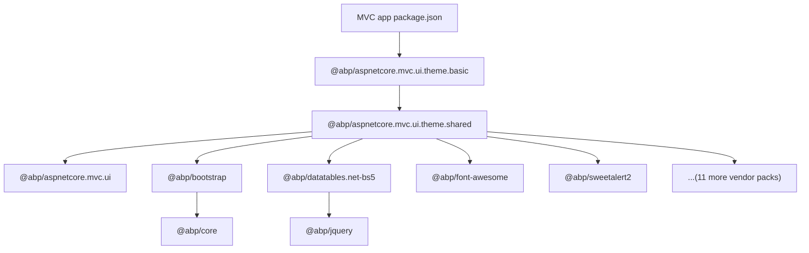

The MVC / Razor Pages UI stack relies on three meta-packages under `npm/packs/`.
Each one is a `package.json` of dependencies — no JavaScript ships in these
directories themselves. They exist to give MVC app templates a small, stable
top-level dependency list that pulls in the full client asset graph through
`abp install-libs`.

## @abp/aspnetcore.mvc.ui — the bottom of the stack

```json
// npm/packs/aspnetcore.mvc.ui/package.json
"name": "@abp/aspnetcore.mvc.ui",
"dependencies": {
  "ansi-colors": "^4.1.3"
}
```

The directory contains only `README.md`, `package.json`, and
`package-lock.json`. Despite the empty dependency surface, it acts as the
"package that an MVC application includes when it just needs ABP's color
logging helpers + a placeholder hook point". Higher-level themes (notably the
LeptonX theme published outside this repo) layer on top of this name.

## @abp/aspnetcore.mvc.ui.theme.shared — the workhorse

`theme.shared` is the package every MVC theme depends on. It enumerates the
entire vendor library set that ABP's MVC layouts assume:

```json
// npm/packs/aspnetcore.mvc.ui.theme.shared/package.json
"name": "@abp/aspnetcore.mvc.ui.theme.shared",
"dependencies": {
  "@abp/aspnetcore.mvc.ui":               "~10.5.0-rc.4",
  "@abp/bootstrap":                       "~10.5.0-rc.4",
  "@abp/bootstrap-datepicker":            "~10.5.0-rc.4",
  "@abp/bootstrap-daterangepicker":       "~10.5.0-rc.4",
  "@abp/datatables.net-bs5":              "~10.5.0-rc.4",
  "@abp/font-awesome":                    "~10.5.0-rc.4",
  "@abp/jquery-validation-unobtrusive":   "~10.5.0-rc.4",
  "@abp/lodash":                          "~10.5.0-rc.4",
  "@abp/luxon":                           "~10.5.0-rc.4",
  "@abp/malihu-custom-scrollbar-plugin":  "~10.5.0-rc.4",
  "@abp/moment":                          "~10.5.0-rc.4",
  "@abp/select2":                         "~10.5.0-rc.4",
  "@abp/sweetalert2":                     "~10.5.0-rc.4",
  "@abp/timeago":                         "~10.5.0-rc.4"
}
```

Reading that list tells you exactly what the MVC UI assumes is on the page:

| Group | Packages | Used for |
| --- | --- | --- |
| Layout | `@abp/bootstrap` | Grid, navbar, modals (Bootstrap 5) |
| Icons | `@abp/font-awesome` | All toolbar / menu icons |
| Forms | `@abp/select2`, `@abp/bootstrap-datepicker`, `@abp/bootstrap-daterangepicker` | Enhanced selects and date pickers |
| Validation | `@abp/jquery-validation-unobtrusive` | Razor `[Required]` / `[Range]` client-side validation |
| Tables | `@abp/datatables.net-bs5` | The grid widget used by every CRUD page |
| Notifications | `@abp/sweetalert2` | Replacement provider for `abp.message.*` and `abp.notify.*` |
| Time | `@abp/luxon`, `@abp/moment`, `@abp/timeago` | Three different time helpers (legacy + modern coexist) |
| Misc | `@abp/lodash`, `@abp/malihu-custom-scrollbar-plugin` | Utilities + sidebar scroll polish |

Notice that **`@abp/jquery` itself is not a direct dependency** — it arrives
transitively through `jquery-validation-unobtrusive →
jquery-validation → jquery` and through `datatables.net`. Both vendor packs
have `@abp/jquery` as a `dependencies` entry, so npm/yarn resolves it once.

## @abp/aspnetcore.mvc.ui.theme.basic — the default theme

The "basic" theme is a thin wrapper:

```json
// npm/packs/aspnetcore.mvc.ui.theme.basic/package.json
"name": "@abp/aspnetcore.mvc.ui.theme.basic",
"dependencies": {
  "@abp/aspnetcore.mvc.ui.theme.shared": "~10.5.0-rc.4"
}
```

It exists so that an application's `package.json` can pin a *theme* rather than
the underlying `theme.shared` — leaving room for the LeptonX or LeptonTheme
packages (shipped from the commercial repos) to slot in by replacing this one
dependency line.

## Putting it together in an MVC project

A freshly scaffolded MVC project's `package.json` typically declares only:

```json
{
  "dependencies": {
    "@abp/aspnetcore.mvc.ui.theme.basic": "~10.5.0-rc.4"
  }
}
```

Running `abp install-libs` then:

1. Walks the resolved npm tree (basic → shared → every vendor pack → `@abp/core`).
2. Finds each `abp.resourcemapping.js` (see `npm/packs/core/abp.resourcemapping.js`
   for the canonical shape).
3. Copies the listed source files into `wwwroot/libs/<destination>`.

The implementation lives in
`framework/src/Volo.Abp.Cli.Core/Volo/Abp/Cli/LIbs/InstallLibsService.cs`,
specifically the `CleanAndCopyResources` method that searches for
`abp.resourcemapping.js` under `node_modules`.

## Mermaid summary



## Related

<CardGroup cols={2}>
  <Card title="Vendor libraries" href="/npm-packs/vendor-libraries">
    Complete table of every `@abp/<vendor>` package.
  </Card>
  <Card title="Blazor theming bundles" href="/npm-packs/theme-shared-and-basic">
    The Blazor Server equivalents — smaller surface, same idea.
  </Card>
  <Card title="@abp/core" href="/npm-packs/core-and-utils">
    The `abp.js` runtime that sits underneath everything.
  </Card>
</CardGroup>
