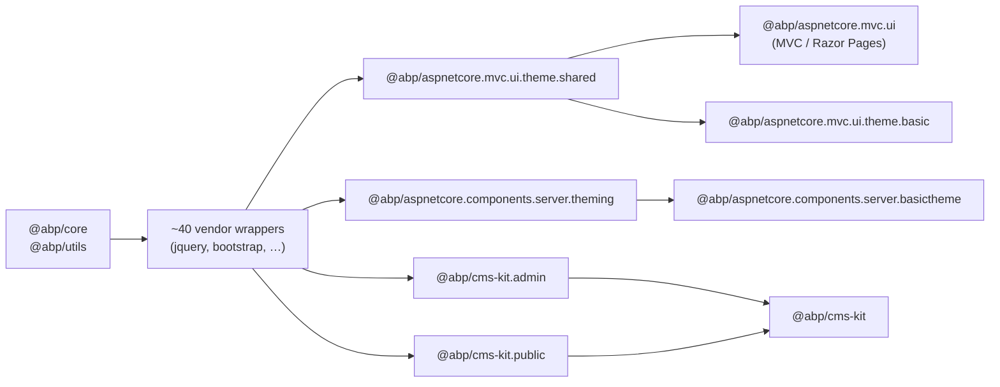

`npm/packs/` is the home of the `@abp/*` npm packages that ship **browser assets**
(CSS, JS, fonts, sprites) rather than TypeScript code. They exist so that the
MVC / Razor Pages and Blazor Server UIs can declare a single `package.json`
dependency, run `abp install-libs`, and end up with vendor libraries (jQuery,
Bootstrap, DataTables, SweetAlert2, …) copied into `wwwroot/libs` for serving as
static files.

There are about fifty packages in this directory; they split into four
categories.

## install-libs in one paragraph

The `abp install-libs` command is implemented in
`framework/src/Volo.Abp.Cli.Core/Volo/Abp/Cli/Commands/InstallLibsCommand.cs`
and `Volo/Abp/Cli/LIbs/InstallLibsService.cs`. For every `.csproj` it finds, the
service runs `yarn` in the project directory and then calls
`CleanAndCopyResources`, which walks `abp.resourcemapping.js` files and copies
the listed sources into `./wwwroot/libs`:

```javascript
// npm/packs/core/abp.resourcemapping.js
module.exports = {
  mappings: {
    "@node_modules/@abp/core/src/*": "@libs/abp/core/"
  }
}
```

Every UI-facing pack ships its own `abp.resourcemapping.js`, which is why
adding a single `@abp/core` dependency to `package.json` is enough — the CLI
discovers the mapping automatically.

## Categories



| Category | Purpose | Representative packages |
| --- | --- | --- |
| **Foundation** | The `abp.js` browser runtime and a TypeScript-friendly helper | `@abp/core`, `@abp/utils` |
| **MVC / Razor Pages theming** | Bundles vendor packs for the MVC UI layer | `@abp/aspnetcore.mvc.ui`, `@abp/aspnetcore.mvc.ui.theme.shared`, `@abp/aspnetcore.mvc.ui.theme.basic` |
| **Blazor Server theming** | Same idea, smaller dependency surface | `@abp/aspnetcore.components.server.theming`, `@abp/aspnetcore.components.server.basictheme` |
| **CMS Kit & Blogging** | Pulls in editors and presentational libs | `@abp/cms-kit`, `@abp/cms-kit.admin`, `@abp/cms-kit.public`, `@abp/blogging` |
| **Vendor wrappers** | One small package per third-party lib | `@abp/jquery`, `@abp/bootstrap`, `@abp/datatables.net-bs5`, `@abp/sweetalert2`, … |

The vendor wrappers are catalogued in
[vendor libraries](/npm-packs/vendor-libraries). The other groups each have a
dedicated page:

<CardGroup cols={2}>
  <Card title="@abp/core & @abp/utils" href="/npm-packs/core-and-utils">
    `abp.js` runtime (event bus, ajax, localization) and the LinkedList helper.
  </Card>
  <Card title="MVC UI bundles" href="/npm-packs/aspnetcore-mvc-ui">
    `mvc.ui`, `mvc.ui.theme.shared`, `mvc.ui.theme.basic` and what each adds.
  </Card>
  <Card title="Blazor theming bundles" href="/npm-packs/theme-shared-and-basic">
    `components.server.theming` and `components.server.basictheme`.
  </Card>
  <Card title="CMS Kit & blogging packs" href="/npm-packs/cms-kit-packs">
    Editors, slugify, prismjs, owl carousel and the meta-packages.
  </Card>
  <Card title="Vendor libraries" href="/npm-packs/vendor-libraries">
    The full table of jQuery, Bootstrap, DataTables, SweetAlert2, etc.
  </Card>
</CardGroup>

## Conventions

Every UI-facing package in `npm/packs/` follows the same conventions:

1. `package.json` with `name: "@abp/<dir>"`, version pinned to the framework
   release (`10.5.0-rc.4` at the time of writing), and a single (or few) vendor
   dependency.
2. Optional `abp.resourcemapping.js` that maps `@node_modules/<lib>` to
   `@libs/<path>`.
3. No source code beyond what's required to expose the vendor files.

Meta-packages (`@abp/cms-kit`, `@abp/aspnetcore.mvc.ui.theme.shared`,
`@abp/aspnetcore.mvc.ui.theme.basic`) carry only `dependencies` — they exist to
pull a curated tree of other packs.

## See also

- [Framework MVC UI overview](/framework/ui-mvc/overview) — the consumer side.
- [`@abp/ng.core`](/ng-packs/core) — the Angular runtime, which does *not*
  consume any of `npm/packs/`.
