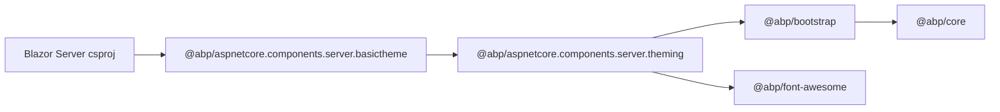

Blazor Server applications render most of their UI through Razor Components,
so they don't need the full bag of jQuery plugins that the MVC stack ships.
ABP exposes that smaller surface as two meta-packages under `npm/packs/`.

## @abp/aspnetcore.components.server.theming

```json
// npm/packs/aspnetcore.components.server.theming/package.json
"name": "@abp/aspnetcore.components.server.theming",
"dependencies": {
  "@abp/bootstrap":    "~10.5.0-rc.4",
  "@abp/font-awesome": "~10.5.0-rc.4"
}
```

Just two dependencies: Bootstrap 5 (for the layout / utility classes used by
the Blazorise-based components ABP ships) and Font Awesome (for icons). The
`@abp/bootstrap` package transitively brings `@abp/core` — so the `abp.js`
runtime is present in Blazor Server apps too, mainly used by the auth and
configuration bootstrap scripts and by the `abp.event` bus.

## @abp/aspnetcore.components.server.basictheme

```json
// npm/packs/aspnetcore.components.server.basictheme/package.json
"name": "@abp/aspnetcore.components.server.basictheme",
"dependencies": {
  "@abp/aspnetcore.components.server.theming": "~10.5.0-rc.4"
}
```

A one-line wrapper, the Blazor equivalent of
`@abp/aspnetcore.mvc.ui.theme.basic`. Apps depend on the `*.basictheme` name
so they can later swap it for LeptonX (or another commercial theme) by
replacing this single entry.

## Why so much smaller than MVC?

Compare with `@abp/aspnetcore.mvc.ui.theme.shared`, which lists fourteen vendor
dependencies (`select2`, `datatables.net-bs5`, `sweetalert2`, `bootstrap-datepicker`,
`luxon`, `moment`, `lodash`, …). Blazor Server replaces all of those with C#
components — DataTables is replaced by ABP's `<DataGrid>`, SweetAlert by
ABP's message service backed by Blazorise modals, and so on. Only the
**presentational** vendor libs (Bootstrap + Font Awesome) remain.

## install-libs flow



`abp install-libs` walks this graph exactly as it does the MVC tree — it does
not distinguish between MVC and Blazor Server projects. See
`framework/src/Volo.Abp.Cli.Core/Volo/Abp/Cli/LIbs/InstallLibsService.cs` for
the implementation.

## Related

- [npm/packs overview](/npm-packs/overview) — the larger asset map.
- [MVC UI bundles](/npm-packs/aspnetcore-mvc-ui) — the counterpart for MVC.
- [Vendor libraries](/npm-packs/vendor-libraries) — table of every `@abp/<vendor>` package.
