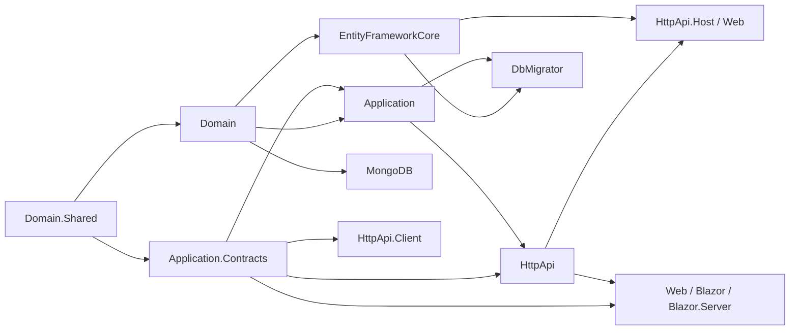

ABP is best understood as a **module composition engine on top of `Microsoft.Extensions.DependencyInjection`**. An application is one C# assembly whose entry point hands a single "startup module" to `AbpApplicationFactory`. ABP discovers every module transitively reachable through `[DependsOn(...)]` attributes, runs three service-configuration phases, builds a service provider, then runs three initialization phases. Once initialized the application exposes the same `IServiceProvider` your code uses everywhere — there is no parallel container, no custom DI surface. This page traces that bootstrap pipeline against the real code in `framework/src/Volo.Abp.Core/`, then explains the layered solution structure and the Castle DynamicProxy-based interceptor pipeline that implements ABP's cross-cutting concerns.

## The bootstrap pipeline

The entry point is `Volo.Abp.AbpApplicationFactory` (`framework/src/Volo.Abp.Core/Volo/Abp/AbpApplicationFactory.cs`). It exposes two families of overloads:

```csharp
// Internal container (ABP owns the IServiceCollection)
var app = await AbpApplicationFactory.CreateAsync<MyAppModule>(opts => { /* … */ });
app.Initialize();

// External container (ASP.NET Core hosting owns the IServiceCollection)
builder.Services.AddApplicationAsync<MyAppModule>(); // wraps Factory.CreateAsync(services, …)
```

Both ultimately construct an `AbpApplicationBase` subclass (`AbpApplicationWithInternalServiceProvider` or `AbpApplicationWithExternalServiceProvider`). The constructor (in `AbpApplicationBase.cs`) performs the **module loading** step *before* services are configured:

```csharp
services.AddSingleton<IAbpApplication>(this);
services.AddSingleton<IApplicationInfoAccessor>(this);
services.AddSingleton<IModuleContainer>(this);
services.AddSingleton<IAbpHostEnvironment>(new AbpHostEnvironment() { EnvironmentName = options.Environment });

services.AddCoreServices();
services.AddCoreAbpServices(this, options);

Modules = LoadModules(services, options);

if (!options.SkipConfigureServices)
{
    ConfigureServices();
}
```

`LoadModules` delegates to `IModuleLoader` (default `ModuleLoader` in `framework/src/Volo.Abp.Core/Volo/Abp/Modularity/ModuleLoader.cs`):

1. **`FillModules`** — recursively walks `[DependsOn]` from the startup module using `AbpModuleHelper.FindAllModuleTypes`, then adds plug-in modules from `options.PlugInSources`.
2. **`SetDependencies`** — wires every `AbpModuleDescriptor` to its depended descriptors.
3. **`SortByDependency`** — topological sort so dependencies come first; the startup module is *moved last* via `sortedModules.MoveItem(m => m.Type == startupModuleType, modules.Count - 1)` so user code runs last.

Each module instance is created with `Activator.CreateInstance(moduleType)` and registered as a singleton (`services.AddSingleton(moduleType, module)`).

### Three service-configuration phases

`ConfigureServices()` (and its async sibling `ConfigureServicesAsync()`) iterates modules **in dependency order** three times. The relevant block from `AbpApplicationBase.cs`:

```csharp
//PreConfigureServices
foreach (var module in Modules.Where(m => m.Instance is IPreConfigureServices))
    ((IPreConfigureServices)module.Instance).PreConfigureServices(context);

//ConfigureServices  (also auto-registers assemblies for conventional DI)
foreach (var module in Modules)
{
    if (module.Instance is AbpModule abpModule && !abpModule.SkipAutoServiceRegistration)
        foreach (var assembly in module.AllAssemblies)
            Services.AddAssembly(assembly);
    module.Instance.ConfigureServices(context);
}

//PostConfigureServices
foreach (var module in Modules.Where(m => m.Instance is IPostConfigureServices))
    ((IPostConfigureServices)module.Instance).PostConfigureServices(context);
```

`AbpModule` (`framework/src/Volo.Abp.Core/Volo/Abp/Modularity/AbpModule.cs`) is the abstract base — it implements *all* lifecycle interfaces and provides empty `virtual` defaults plus `protected Configure<TOptions>(…)` and `PreConfigure<TOptions>(…)` helpers that delegate to `ServiceConfigurationContext.Services.Configure(…)`.

`Services.AddAssembly(assembly)` walks every type in the module's assemblies and lets the registered `IConventionalRegistrar`s decide which services to add — this is how `ITransientDependency`, `IScopedDependency`, `ISingletonDependency` and `[ExposeServices]` produce DI registrations without explicit `AddTransient` calls.

### Three initialization phases

After the host builds the service provider, `app.Initialize()` (or `InitializeAsync`) calls `SetServiceProvider` then `InitializeModules`. The work is delegated to `IModuleManager` (`framework/src/Volo.Abp.Core/Volo/Abp/Modularity/ModuleManager.cs`):

```csharp
foreach (var contributor in _lifecycleContributors)
    foreach (var module in _moduleContainer.Modules)
        await contributor.InitializeAsync(context, module.Instance);
```

The default contributors live in `framework/src/Volo.Abp.Core/Volo/Abp/Modularity/DefaultModuleLifecycleContributor.cs`:

| Contributor | Interface checked | Phase order |
| --- | --- | --- |
| `OnPreApplicationInitializationModuleLifecycleContributor` | `IOnPreApplicationInitialization` | 1 |
| `OnApplicationInitializationModuleLifecycleContributor` | `IOnApplicationInitialization` | 2 |
| `OnPostApplicationInitializationModuleLifecycleContributor` | `IOnPostApplicationInitialization` | 3 |
| `OnApplicationShutdownModuleLifecycleContributor` | `IOnApplicationShutdown` | on shutdown (modules in reverse) |

This is what gives ABP its predictable "initialize all infrastructure before user code runs" guarantee: contributors fire **per phase across all modules**, not per module across all phases.

### Sequence diagram

```mermaid
sequenceDiagram
    autonumber
    participant Host as Host (Program.cs)
    participant Factory as AbpApplicationFactory
    participant App as AbpApplicationBase
    participant Loader as ModuleLoader
    participant Mgr as ModuleManager
    participant Mods as Module instances

    Host->>Factory: CreateAsync&lt;TStartupModule&gt;(opts)
    Factory->>App: new AbpApplicationWith…ServiceProvider(...)
    App->>App: services.AddSingleton(IAbpApplication, IModuleContainer, IAbpHostEnvironment)
    App->>App: services.AddCoreServices() + AddCoreAbpServices()
    App->>Loader: LoadModules(services, startupModuleType, plugInSources)
    Loader->>Loader: FindAllModuleTypes via [DependsOn]
    Loader->>Loader: Topological sort, startup last
    Loader-->>App: IAbpModuleDescriptor[]
    Factory->>App: await ConfigureServicesAsync()
    App->>Mods: PreConfigureServices(context) (each module impl)
    App->>Mods: AddAssembly + ConfigureServices(context)
    App->>Mods: PostConfigureServices(context)
    Host->>Host: services.BuildServiceProvider()
    Host->>App: app.Initialize() / InitializeAsync()
    App->>App: SetServiceProvider(sp)
    App->>Mgr: InitializeModulesAsync(ApplicationInitializationContext)
    Mgr->>Mods: OnPreApplicationInitialization (all modules)
    Mgr->>Mods: OnApplicationInitialization (all modules)
    Mgr->>Mods: OnPostApplicationInitialization (all modules)
    App-->>Host: ready
    Note over Host,Mods: At process exit
    Host->>App: ShutdownAsync()
    App->>Mgr: ShutdownModulesAsync (reverse order)
    Mgr->>Mods: OnApplicationShutdown
```

<Note>
Steps 11–13 happen **before** the service provider is built — `IServiceCollection` is still mutable. Steps 17–19 happen **after** the provider is built and run inside `ServiceProvider.CreateScope()`, so initialization code can resolve scoped services like `IUnitOfWorkManager` or `IDataSeeder`.
</Note>

If `options.SkipConfigureServices == true` (the path `AbpApplicationFactory.CreateAsync` always takes — note `options.SkipConfigureServices = true` in the factory body), the constructor skips `ConfigureServices()` and the caller is expected to `await app.ConfigureServicesAsync()`. The synchronous `Create` overloads keep the constructor-side configuration.

## Layered architecture

A generated ABP solution maps the bootstrap model onto a fixed set of **project layers**. Every layer is a regular C# project that exposes an `AbpModule` class; the dependency graph between modules mirrors the project references. The canonical layering, observed in `templates/app/aspnet-core/src/` and in module solutions like `modules/identity/src/`:



| Layer | Project suffix | Typical contents | Depends on |
| --- | --- | --- | --- |
| Domain.Shared | `*.Domain.Shared` | Enums, constants, error codes, localization keys, shared DTOs that live below the domain (no behaviour). | nothing app-specific |
| Domain | `*.Domain` | `AggregateRoot`, `Entity`, domain services, repository interfaces, domain events. | Domain.Shared |
| Application.Contracts | `*.Application.Contracts` | DTOs, application-service interfaces, permission definitions, feature definitions. | Domain.Shared |
| Application | `*.Application` | Implementations of application services, AutoMapper profiles, authorization. | Domain, Application.Contracts |
| HttpApi | `*.HttpApi` | ASP.NET Core controllers that surface application services. | Application.Contracts |
| HttpApi.Client | `*.HttpApi.Client` | Dynamic HTTP client proxies for the same application services. | Application.Contracts |
| EntityFrameworkCore | `*.EntityFrameworkCore` | `DbContext`, EF Core mappings, EF repository implementations. | Domain |
| MongoDB | `*.MongoDB` | Mongo `IAbpMongoDbContext`, repositories. | Domain |
| Web | `*.Web` | Razor Pages, view components, bundling, menu contributors. | HttpApi, Application.Contracts |
| Blazor / Blazor.Server / Blazor.WebApp | `*.Blazor*` | Blazor Server, WebAssembly or WebApp host with theming. | HttpApi.Client (or HttpApi for in-process) |
| DbMigrator | `*.DbMigrator` | Console host that runs EF migrations + `IDataSeeder`. | EntityFrameworkCore, Application |
| Installer (modules only) | `*.Installer` | NuGet-as-installer helpers consumed by the ABP CLI. | — |

See [`/overview/solution-structure`](/overview/solution-structure) for a per-project deep dive.

## DI conventions

ABP's `services.AddAssembly(assembly)` (from `Volo.Abp.DependencyInjection`) iterates the assembly and applies every registered `IConventionalRegistrar` (`framework/src/Volo.Abp.Core/Volo/Abp/DependencyInjection/IConventionalRegistrar.cs`). The default `DefaultConventionalRegistrar` registers anything that implements:

- `ITransientDependency` → `ServiceLifetime.Transient`
- `IScopedDependency` → `ServiceLifetime.Scoped`
- `ISingletonDependency` → `ServiceLifetime.Singleton`

…plus all `[ExposeServices(typeof(…))]` declared services. `IModuleManager` itself, for example, is `public class ModuleManager : IModuleManager, ISingletonDependency` — that single line is its DI registration.

Additional conventions:

- **`[Dependency]`** attribute can override lifetime, override existing registration or set the registration order.
- **`[ExposeServices(IncludeDefaults = true)]`** — exposes the implementation as itself + every base interface ending in the same name.
- **`IObjectAccessor<T>`** (`framework/src/Volo.Abp.Core/Volo/Abp/DependencyInjection/ObjectAccessor.cs`) — late-bound singleton holder used to share things like `IServiceProvider` between `ConfigureServices` and runtime.
- **`PreConfigure<TOptions>` / `Configure<TOptions>` / `PostConfigure<TOptions>`** — the only sanctioned way to mutate options across module boundaries (see `AbpModule.cs`).

<Tip>
A module can opt out of automatic assembly scanning by setting `SkipAutoServiceRegistration = true` in its constructor — useful for assemblies that contain types you don't want auto-registered (e.g. EF Core test contexts).
</Tip>

## Cross-cutting interceptors

ABP wraps **every conventionally registered service** in a Castle DynamicProxy proxy when one of the interceptor registrars marks it. The interceptors implement the framework's cross-cutting concerns without bleeding into application code. The four headline interceptors and the file each lives in:

| Interceptor | Registrar | Source file | Triggered by |
| --- | --- | --- | --- |
| `UnitOfWorkInterceptor` | `UnitOfWorkInterceptorRegistrar` | `framework/src/Volo.Abp.Uow/Volo/Abp/Uow/UnitOfWorkInterceptor.cs` | `[UnitOfWork]` attribute, application services, controllers, page handlers — opens an ambient `IUnitOfWork`, commits on success, rolls back on exception |
| `AuditingInterceptor` | `AuditingInterceptorRegistrar` | `framework/src/Volo.Abp.Auditing/Volo/Abp/Auditing/AuditingInterceptor.cs` | `[Audited]` / `[DisableAuditing]` and the audited-types option — records an `AuditLogActionInfo` per call |
| `AuthorizationInterceptor` | `AuthorizationInterceptorRegistrar` | `framework/src/Volo.Abp.Authorization/Volo/Abp/Authorization/AuthorizationInterceptor.cs` | `[Authorize]`, `[AllowAnonymous]`, declared permissions — invokes `IMethodInvocationAuthorizationService` |
| `ValidationInterceptor` | `ValidationInterceptorRegistrar` | `framework/src/Volo.Abp.Validation/Volo/Abp/Validation/ValidationInterceptor.cs` | data-annotation / `IValidatableObject` / FluentValidation rules on method arguments |

Other notable interceptors registered the same way: feature checking (`FeatureInterceptor` in `framework/src/Volo.Abp.Features/`), global feature checking (`GlobalFeatureInterceptor`), and change tracking (`ChangeTrackingInterceptor` in `framework/src/Volo.Abp.Ddd.Domain/Volo/Abp/Domain/ChangeTracking/`).

The actual proxy creation happens in either the **Autofac integration** (`framework/src/Volo.Abp.Autofac/`) — registered with `services.AddAutofacServiceProviderFactory()` — or, since ABP 8+, via the **Castle.Core** integration (`framework/src/Volo.Abp.Castle.Core/Volo/Abp/Castle/DynamicProxy/AbpAsyncDeterminationInterceptor.cs`) that adapts sync/async interceptor calls. The host opts in via `UseAutofac()` in `Program.cs`.


<Warning>
Interceptors only fire when calls go through DI — i.e. the consumer received an `IFoo` from the container. Direct `new MyAppService()` calls in tests bypass the proxy and skip every cross-cutting concern. Repository methods called on aggregate-roots also bypass UoW unless an ambient UoW is already open.
</Warning>

## Putting it together

The day-to-day path that brings every piece of ABP into play looks like this:

1. Host calls `services.AddApplicationAsync<MyAppModule>()` → `AbpApplicationFactory.CreateAsync` → `AbpApplicationWithExternalServiceProvider` constructor → `ModuleLoader.LoadModules` finds the whole `[DependsOn]` graph (typically dozens of modules).
2. `ConfigureServicesAsync` runs `PreConfigureServices` (modules wire options), then `ConfigureServices` (modules call `Configure<TOptions>(…)` and register their own services), then `PostConfigureServices` (last-chance wiring after dependencies have configured).
3. The host builds `IServiceProvider` via Autofac (with the interceptor adapter) and calls `app.InitializeAsync()`.
4. `ModuleManager` runs the three init phases. By the end, infrastructure such as the event-bus subscription registrar (`AbpEventBusModule.OnApplicationInitialization`), permission/feature/setting providers, the BLOB provider selector and the dynamic-API discovery have all been wired.
5. An HTTP request arrives. ASP.NET routes it to a controller produced by `AbpAspNetCoreMvcModule`'s conventional routing. The controller call is interception-wrapped: UoW opens → Authorization checks → Validation runs → method executes → Audit records → UoW commits.
6. At shutdown, `ModuleManager.ShutdownModulesAsync` walks modules in reverse so disposers fire in the opposite order from startup.

Read on:

<CardGroup cols={2}>
  <Card title="Solution Structure" icon="layer-group" href="/overview/solution-structure">
    Exhaustive per-project responsibilities and dependency rules.
  </Card>
  <Card title="Glossary" icon="book" href="/overview/glossary">
    Every term used above with a one-line definition and source file.
  </Card>
  <Card title="Core Runtime" icon="microchip" href="/framework/core/overview">
    Deep dive on `Volo.Abp.Core`, options system, conventional registrars.
  </Card>
  <Card title="Startup Flow" icon="diagram-project" href="/flows/application-startup">
    Tick-by-tick trace of one real bootstrap.
  </Card>
</CardGroup>
