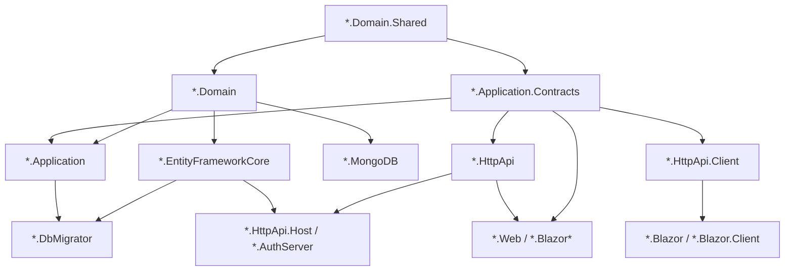

ABP applications and modules ship as a fixed set of layered C# projects — the same set whether you generate a brand-new app from `templates/app/aspnet-core/` or open `modules/identity/src/`. Each layer has a single responsibility, exposes one `AbpModule` class, and references only the layers below it. This page walks through every project type, what it contains, and what it is allowed to depend on. Two reference solutions to keep open while reading: the **app template** at `templates/app/aspnet-core/src/MyCompanyName.MyProjectName.*` and the **Identity module** at `modules/identity/src/Volo.Abp.Identity.*`.

## The full project list (app template)

Running `ls templates/app/aspnet-core/src/` yields the complete set of project folders the CLI scaffolds:

```text
MyCompanyName.MyProjectName.Domain.Shared
MyCompanyName.MyProjectName.Domain
MyCompanyName.MyProjectName.Application.Contracts
MyCompanyName.MyProjectName.Application
MyCompanyName.MyProjectName.HttpApi
MyCompanyName.MyProjectName.HttpApi.Client
MyCompanyName.MyProjectName.HttpApi.Host
MyCompanyName.MyProjectName.HttpApi.HostWithIds
MyCompanyName.MyProjectName.EntityFrameworkCore
MyCompanyName.MyProjectName.MongoDB
MyCompanyName.MyProjectName.DbMigrator
MyCompanyName.MyProjectName.AuthServer
MyCompanyName.MyProjectName.Web
MyCompanyName.MyProjectName.Web.Host
MyCompanyName.MyProjectName.Blazor                       # Blazor WebAssembly (standalone)
MyCompanyName.MyProjectName.Blazor.Client
MyCompanyName.MyProjectName.Blazor.Server
MyCompanyName.MyProjectName.Blazor.Server.Tiered
MyCompanyName.MyProjectName.Blazor.WebApp
MyCompanyName.MyProjectName.Blazor.WebApp.Client
MyCompanyName.MyProjectName.Blazor.WebApp.Tiered
MyCompanyName.MyProjectName.Blazor.WebApp.Tiered.Client
```

A pre-built module (`modules/identity/src/`) ships a slightly narrower set — no `*.Web.Host`/`*.AuthServer`/`*.DbMigrator`, and an additional `*.Installer` project consumed by the CLI to install the module into an existing solution:

```text
Volo.Abp.Identity.Domain.Shared
Volo.Abp.Identity.Domain
Volo.Abp.Identity.Application.Contracts
Volo.Abp.Identity.Application
Volo.Abp.Identity.HttpApi
Volo.Abp.Identity.HttpApi.Client
Volo.Abp.Identity.AspNetCore
Volo.Abp.Identity.EntityFrameworkCore
Volo.Abp.Identity.MongoDB
Volo.Abp.Identity.Web
Volo.Abp.Identity.Blazor
Volo.Abp.Identity.Blazor.Server
Volo.Abp.Identity.Blazor.WebAssembly
Volo.Abp.Identity.Blazor.MudBlazor
Volo.Abp.Identity.Blazor.MudBlazor.Server
Volo.Abp.Identity.Blazor.MudBlazor.WebAssembly
Volo.Abp.Identity.Installer
Volo.Abp.PermissionManagement.Domain.Identity
```

## Layer responsibilities

| Project suffix | Responsibility | Typical contents | References (project) |
| --- | --- | --- | --- |
| `*.Domain.Shared` | Constants and types both server *and* client can see. **Must contain no behaviour.** | Enums, error codes, localization keys, public DTO-like records, `*Consts.cs`. Example: `templates/app/aspnet-core/src/MyCompanyName.MyProjectName.Domain.Shared/`. | none (only NuGets) |
| `*.Domain` | Domain model: aggregates, entities, value objects, domain services, repository **interfaces**, domain events. | `BasicAggregateRoot` / `AggregateRoot` subclasses (`framework/src/Volo.Abp.Ddd.Domain/Volo/Abp/Domain/Entities/AggregateRoot.cs`), `IRepository<TEntity, TKey>` declarations, `ISettingDefinitionProvider`. | `*.Domain.Shared` + domain layers of depended modules (Identity, AuditLogging, BackgroundJobs, …) |
| `*.Application.Contracts` | The "API" of the application layer: DTOs, service interfaces, permission/feature definitions. **Shipped to the client.** | `IFooAppService : IApplicationService`, `FooDto`, `CreateUpdateFooDto`, `FooPermissions`, `FooPermissionDefinitionProvider`. | `*.Domain.Shared` |
| `*.Application` | Implementations of application services. Orchestrates domain operations and persists via repositories. | `FooAppService : ApplicationService, IFooAppService`, AutoMapper profiles, authorization providers. | `*.Domain`, `*.Application.Contracts` |
| `*.HttpApi` | ASP.NET Core controllers that expose application services. Controllers usually inherit from `AbpController`. | Thin controllers; can rely on ABP's *conventional dynamic routing* so explicit controllers are optional. | `*.Application.Contracts` |
| `*.HttpApi.Client` | Dynamic HTTP **client** proxies for the same application-service interfaces — generated at runtime via `AddHttpClientProxies(typeof(...).Assembly, "...")`. | `*HttpApiClientModule` calls `context.Services.AddHttpClientProxies(...)`. | `*.Application.Contracts` |
| `*.EntityFrameworkCore` | EF Core `DbContext`, mappings, EF repository implementations. | `*DbContext : AbpDbContext<>`, `*EntityFrameworkCoreModule` configures `AddAbpDbContext<...>`. | `*.Domain` |
| `*.MongoDB` | MongoDB `IAbpMongoDbContext`, document maps, Mongo repository implementations. | `*MongoDbContext`, repositories that implement `IRepository<TEntity,TKey>`. | `*.Domain` |
| `*.Web` | Razor Pages / MVC views, view components, menu contributors, bundling, tag helpers. | `*WebModule`, `Pages/`, `Menus/`, `Bundling/`. | `*.HttpApi`, `*.Application.Contracts` (and in modules: the matching `*.HttpApi.Client` for separated deployments) |
| `*.Web.Host` | Host project for the MVC UI (entry point + appsettings). | `Program.cs`, `appsettings*.json`. | `*.Web`, `*.EntityFrameworkCore`/`*.MongoDB` |
| `*.HttpApi.Host` | Stand-alone REST API host. | `Program.cs`, `*HttpApiHostModule`. Used in the *tiered* / *microservice* deployment variants. | `*.HttpApi`, `*.EntityFrameworkCore`/`*.MongoDB` |
| `*.HttpApi.HostWithIds` | Combined HttpApi + IdentityServer host (legacy; OpenIddict templates use `*.AuthServer` instead). | — | as above |
| `*.AuthServer` | The OpenIddict-based authentication server host (separate process in tiered topology). | `Program.cs` configures OpenIddict + the Account/Identity UI. | `*.Web` (or a subset) |
| `*.Blazor` | Blazor WebAssembly client UI. | Razor components, services, `*BlazorModule`. | `*.HttpApi.Client` |
| `*.Blazor.Client` | The WebAssembly half of a *Blazor WebApp* (interactive client). | `*BlazorClientModule`. | `*.HttpApi.Client` |
| `*.Blazor.Server` | Blazor **Server** host. | `Program.cs`. | `*.Blazor` (shared components) |
| `*.Blazor.Server.Tiered` | Same as `*.Blazor.Server` but configured to call a remote `HttpApi.Host`. | — | `*.HttpApi.Client` |
| `*.Blazor.WebApp` / `*.Blazor.WebApp.Client` / `*.Blazor.WebApp.Tiered` / `*.Blazor.WebApp.Tiered.Client` | The four flavours of the .NET 8+ "Blazor Web App" topology. | `*BlazorWebAppModule` + matching client. | as above |
| `*.DbMigrator` | Console host that runs EF Core migrations and `IDataSeeder`. | `Program.cs` builds a host with `MyAppDbMigratorModule` and calls `DataSeeder.SeedAsync()`. | `*.EntityFrameworkCore`, `*.Application` |
| `*.Installer` (modules only) | Distributed as a NuGet "installer" — the ABP CLI inspects it (e.g. `Volo.Abp.Identity.Installer/InstallationNotes.md`, `AngularInstallationInfo.json`) to know how to wire the module into a host solution. | `InstallationNotes.md`, `AngularInstallationInfo.json`. | none |
| `*.AspNetCore` (modules only) | ASP.NET Core glue exposed by some modules separately from `*.Web` (e.g. `Volo.Abp.Identity.AspNetCore`). | Pipeline contributors, options. | `*.Domain`/`*.Application.Contracts` as needed |

## Dependency rules

The arrows below come straight from the `.csproj` `<ProjectReference>` lists. A real example from `templates/app/aspnet-core/src/MyCompanyName.MyProjectName.Domain/MyCompanyName.MyProjectName.Domain.csproj`:

```xml
<ProjectReference Include="..\MyCompanyName.MyProjectName.Domain.Shared\MyCompanyName.MyProjectName.Domain.Shared.csproj" />
<ProjectReference Include="..\..\..\..\..\modules\identity\src\Volo.Abp.Identity.Domain\Volo.Abp.Identity.Domain.csproj" />
<ProjectReference Include="..\..\..\..\..\modules\openiddict\src\Volo.Abp.OpenIddict.Domain\Volo.Abp.OpenIddict.Domain.csproj" />
<!-- … BackgroundJobs.Domain, AuditLogging.Domain, TenantManagement.Domain, etc. -->
```

So `*.Domain` references only **Domain.Shared** of the same solution plus the **Domain layers of every depended module** — never another solution's `*.Application` or `*.HttpApi`.



<Note>
The `EntityFrameworkCore` and `MongoDB` projects sit **next to each other** — they do not reference one another. A real deployment usually ships only one of them; the other becomes dead weight until you swap providers.
</Note>

## Each layer's `AbpModule`

Every project exposes exactly one module class, named after the project (`MyCompanyName.MyProjectName.{Layer}Module`). The module's `[DependsOn]` list is the *runtime* equivalent of the project's `<ProjectReference>` list. Example pattern from any `*.DomainModule`:

```csharp
[DependsOn(
    typeof(MyCompanyNameMyProjectNameDomainSharedModule),
    typeof(AbpIdentityDomainModule),
    typeof(AbpOpenIddictDomainModule),
    typeof(AbpAuditLoggingDomainModule),
    typeof(AbpBackgroundJobsDomainModule),
    typeof(AbpTenantManagementDomainModule),
    typeof(AbpFeatureManagementDomainModule),
    typeof(AbpSettingManagementDomainModule)
)]
public class MyProjectNameDomainModule : AbpModule
{
    public override void ConfigureServices(ServiceConfigurationContext context) { /* … */ }
}
```

ABP's `ModuleLoader` (see [`/overview/architecture`](/overview/architecture)) topologically sorts these modules and ensures dependencies' `ConfigureServices` runs first.

## Gotchas

- **Never reference `*.Application` from `*.HttpApi`**. Controllers should be written against the interface in `*.Application.Contracts`; the IoC container wires the implementation. Doing otherwise breaks the client proxy generation in `*.HttpApi.Client`.
- **`*.Domain.Shared` and `*.Application.Contracts` are shipped to the client** in tiered or microservice topologies. Anything you put there ends up on the wire — keep them free of EF Core / persistence types.
- **Migrations belong in `*.EntityFrameworkCore`**, not in `*.DbMigrator`. The migrator project only *runs* migrations and seeds data.
- **`SkipAutoServiceRegistration = true`** in a module constructor disables convention-based DI for that assembly — only do this for assemblies that contain types you do not want auto-registered.
- The two **Mongo** and **EF Core** layers must keep their `DbContext` interfaces identical so that swapping providers in `*.Web.Host`/`*.HttpApi.Host` only changes which module is `[DependsOn]`'ed.

## See also

<CardGroup cols={2}>
  <Card title="Architecture" icon="sitemap" href="/overview/architecture">
    How these modules are composed at runtime.
  </Card>
  <Card title="Repository Layout" icon="folder-tree" href="/overview/repository-layout">
    Where each layer's source files actually live on disk.
  </Card>
  <Card title="DDD Building Blocks" icon="cube" href="/framework/ddd/overview">
    The base types `*.Domain` and `*.Application` rely on.
  </Card>
  <Card title="Templates" icon="file-code" href="/templates/overview">
    The full template family that produces these structures.
  </Card>
</CardGroup>
