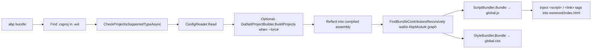

ABP modules ship their own static assets (JavaScript libs, CSS, fonts) and declare them through `IBundleContributor` in each module. For Blazor WebAssembly and MAUI Blazor projects the host has to merge those contributions into a single `wwwroot/global.js` and `wwwroot/global.css` before publish. `abp bundle` does that. Source under `framework/src/Volo.Abp.Cli.Core/Volo/Abp/Cli/Bundling/`.

## Command shape

```bash
abp bundle [options]
  -wd|--working-directory <directory-path>   (default: empty / current)
  -f |--force                                (force a re-build before bundling)
  -t |--project-type                         (default: webassembly | mauiblazor)
```

`BundleCommand.ExecuteAsync` (`framework/src/Volo.Abp.Cli.Core/Volo/Abp/Cli/Commands/BundleCommand.cs`) just forwards to `IBundlingService.BundleAsync`. On macOS the MAUI Blazor mode is skipped with a warning.

## BundlingService

`BundlingService` (`Bundling/BundlingService.cs`) is the orchestrator:



1. **Locate the project.** It picks the single `*.csproj` next to the working directory (errors out if zero or many).
2. **Validate the project type.** `CheckProjectIsSupportedTypeAsync` reads the SDK and target framework to confirm it really is a `Microsoft.NET.Sdk.BlazorWebAssembly` or MAUI Blazor project.
3. **Read `bundle` config.** `IConfigReader` parses `wwwroot/appsettings.json` (WASM) or the project directory (MAUI Blazor) into a `BundleConfig` (`Bundling/BundleConfig.cs`):

   ```csharp framework/src/Volo.Abp.Cli.Core/Volo/Abp/Cli/Bundling/BundleConfig.cs
   public class BundleConfig
   {
       public bool IsBlazorWebApp { get; set; } = false;
       public bool InteractiveAuto { get; set; } = false;
       public BundlingMode Mode { get; set; } = BundlingMode.BundleAndMinify;
       public string Name { get; set; } = "global";
       public BundleParameterDictionary Parameters { get; set; } = new();
   }
   ```

4. **Build if needed.** When `-f/--force` is set, the service shells out to `IDotNetProjectBuilder.BuildProjects` so the next step has fresh DLLs to reflect over.
5. **Load the startup module.** `PathHelper.GetWebAssemblyFilePath` / `GetMauiBlazorAssemblyFilePath` resolve the compiled assembly; `GetStartupModule` finds the class that extends `AbpModule` and is marked as the entry module.
6. **Walk the module graph.** `FindBundleContributorsRecursively` recurses through `[DependsOn]` attributes, instantiating each module's bundle contributors and accumulating their `BundleTypeDefinition`s in dependency order.
7. **Run the bundlers.** `IScriptBundler` and `IStyleBundler` (registered as `ScriptBundler` and `StyleBundler` via `ITransientDependency`) collect the contributions and write the output.

## Bundler implementations

`BundlerBase` (`Bundling/BundlerBase.cs`) is the shared algorithm. It groups contributions into "bundle into the main file" vs `ExcludeFromBundle = true` (kept as separate `<script>`/`<link>` tags), then dispatches per project type:

```csharp framework/src/Volo.Abp.Cli.Core/Volo/Abp/Cli/Bundling/BundlerBase.cs
var bundleFilePath = Path.Combine(PathHelper.GetWwwRootPath(options.Directory),
    $"{options.BundleName}{FileExtension}");
var bundledContent = options.ProjectType == BundlingConsts.WebAssembly
    ? BundleWebAssemblyFiles(options, bundleFileDefinitions)
    : BundleMauiBlazorFiles(options, bundleFileDefinitions);
File.WriteAllText(bundleFilePath, bundledContent);
return GenerateDefinition(bundleFilePath, fileDefinitionsExcludingFromBundle);
```

- `ScriptBundler` (`Bundling/Scripts/ScriptBundler.cs`) — extension `.js`, uses `IJavascriptMinifier` (NUglify) when `BundlingMode.BundleAndMinify`. `GenerateDefinition` emits the `<script>` tag with a cache-busting `?_v=<ticks>` query string.
- `StyleBundler` (`Bundling/Styles/StyleBundler.cs`) — extension `.css`, uses `ICssMinifier`. Same definition shape but emits `<link rel="stylesheet">`.

Already-minified inputs are detected by the `min`/`prod` suffixes in `BundlerBase._minFileSuffixes` and skipped to avoid double-minification.

## Wiring into `index.html`

The bundler returns a definition string and the service replaces the `<!-- ABP-SCRIPTS-PLACEHOLDER -->` / `<!-- ABP-STYLES-PLACEHOLDER -->` markers (`BundlingConsts.ScriptPlaceholderStart`/`End`) in `wwwroot/index.html`. Re-running the command refreshes the cache-busting ticks so browsers always pick up the new content.

## When it runs automatically

`abp new` automatically runs `abp bundle` after creating a Blazor WebAssembly solution unless `-sb/--skip-bundling` is passed (see `NewCommand`). You also call it manually before publishing whenever you add or remove a module so the bundles stay in sync with the dependency graph.

<CardGroup cols={2}>
  <Card title="Install libs" href="/tooling/install-libs">Sibling command that copies NPM assets into `wwwroot/libs`.</Card>
  <Card title="CLI commands" href="/tooling/cli-commands">Full list of every CLI verb.</Card>
</CardGroup>
