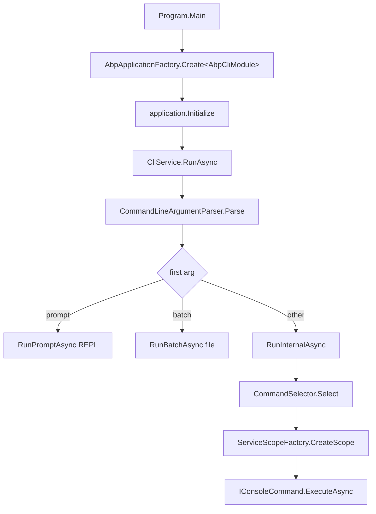

The `abp` command-line tool is a regular ABP application that happens to run in a console. `framework/src/Volo.Abp.Cli/Volo/Abp/Cli/Program.cs` is the only `Main` entry point; everything else — argument parsing, command dispatch, version checks — lives in `framework/src/Volo.Abp.Cli.Core/Volo/Abp/Cli/` and is wired through the same modularity and dependency-injection primitives the framework uses for web apps. This makes the CLI itself a useful reference for how ABP modules compose at runtime.

## Boot sequence

`Program.Main` configures Serilog, creates an `AbpApplication` rooted at `AbpCliModule` (which `[DependsOn]` `AbpCliCoreModule` + `AbpAutofacModule`), initializes it, resolves `CliService`, and calls `RunAsync(args)`. Only the `mcp` sub-command silences the console sink, because the MCP server uses stdout as a JSON-RPC transport and any banner output would corrupt the stream.

```csharp framework/src/Volo.Abp.Cli/Volo/Abp/Cli/Program.cs
using (var application = AbpApplicationFactory.Create<AbpCliModule>(options =>
{
    options.UseAutofac();
    options.Services.AddLogging(c => c.AddSerilog());
}))
{
    application.Initialize();
    await application.ServiceProvider.GetRequiredService<CliService>().RunAsync(args);
    application.Shutdown();
    Log.CloseAndFlush();
}
```

`CliService` (`framework/src/Volo.Abp.Cli.Core/Volo/Abp/Cli/CliService.cs`) is the orchestrator. It logs the CLI version, optionally runs `CheckCliVersionAsync` against the NuGet feed (skipped for `mcp` and when `--skip-cli-version-check` is set), then branches on the first positional argument:

- `prompt` → enters an interactive REPL that re-parses each typed line.
- `batch <file>` → reads commands line-by-line from a text file (lines starting with `#` are comments).
- anything else → `RunInternalAsync` resolves and executes the matching command.



## Argument parsing

`CommandLineArgumentParser` (`framework/src/Volo.Abp.Cli.Core/Volo/Abp/Cli/Args/CommandLineArgumentParser.cs`) implements a small custom grammar rather than reusing `System.CommandLine`. It produces a `CommandLineArgs` record with three slots:

| Slot | Source | Example |
| --- | --- | --- |
| `Command` | first positional | `new` in `abp new Acme.BookStore -u angular` |
| `Target` | second positional, unless it starts with `-` | `Acme.BookStore` |
| `Options` | `AbpCommandLineOptions` dictionary | `{ "u": "angular" }` |

Both `-` and `--` are stripped from option names, and a value-less option is stored with a `null` value. The `Parse(string)` overload tokenises a single string with quote handling, which is what powers `prompt` and `batch` modes.

## Command selection

Every CLI verb implements `IConsoleCommand` from `framework/src/Volo.Abp.Cli.Core/Volo/Abp/Cli/Commands/IConsoleCommand.cs`:

```csharp
public interface IConsoleCommand
{
    Task ExecuteAsync(CommandLineArgs commandLineArgs);
    string GetUsageInfo();
}
```

Commands self-register via `AbpCliOptions.Commands`, a `Dictionary<string, Type>` keyed by the command name (case-insensitive). The bindings live in `AbpCliCoreModule.ConfigureServices`:

```csharp framework/src/Volo.Abp.Cli.Core/Volo/Abp/Cli/AbpCliCoreModule.cs
Configure<AbpCliOptions>(options =>
{
    options.Commands[HelpCommand.Name]          = typeof(HelpCommand);
    options.Commands[NewCommand.Name]           = typeof(NewCommand);
    options.Commands[AddPackageCommand.Name]    = typeof(AddPackageCommand);
    options.Commands[AddModuleCommand.Name]     = typeof(AddModuleCommand);
    options.Commands[GenerateProxyCommand.Name] = typeof(GenerateProxyCommand);
    options.Commands[BundleCommand.Name]        = typeof(BundleCommand);
    options.Commands[InstallLibsCommand.Name]   = typeof(InstallLibsCommand);
    options.Commands[McpCommand.Name]           = typeof(McpCommand);
    // ... ~30 more entries
});
```

`CommandSelector` (`framework/src/Volo.Abp.Cli.Core/Volo/Abp/Cli/Commands/CommandSelector.cs`) is a one-method lookup against that dictionary, with `HelpCommand` as the fallback when the command is empty or unknown. Because everything goes through `Options.Commands`, third-party modules can plug in their own commands simply by adding a `Configure<AbpCliOptions>` call in their own `AbpModule` — no recompilation of the CLI is required.

```csharp framework/src/Volo.Abp.Cli.Core/Volo/Abp/Cli/Commands/CommandSelector.cs
public Type Select(CommandLineArgs commandLineArgs)
{
    if (commandLineArgs.Command.IsNullOrWhiteSpace())
    {
        return typeof(HelpCommand);
    }

    return Options.Commands.GetOrDefault(commandLineArgs.Command)
           ?? typeof(HelpCommand);
}
```

`RunInternalAsync` creates a per-command DI scope via `IServiceScopeFactory`, resolves the selected `IConsoleCommand`, and awaits `ExecuteAsync`. `CliUsageException` is treated as a soft error (sets `ExitCode = 1` and logs the usage banner); any other exception is logged and rethrown.

## Cross-cutting services

`AbpCliCoreModule` also registers the rest of the CLI's collaborators that commands consume:

- `IHttpClientFactory` clients named `CliConsts.HttpClientName` and `CliConsts.GithubHttpClientName` for talking to the ABP backend and GitHub.
- `AbpCliServiceProxyOptions.Generators` — a parallel dictionary that maps `csharp`/`js`/`ng` to `IServiceProxyGenerator` types (see [Service proxying](/tooling/service-proxying)).
- Telemetry: `ITelemetryService` wraps every command in an activity (`ActivityNameConsts.AbpCliRun`) unless `ABP_STUDIO_ENABLE_TELEMETRY=false` is set.

The takeaway is that the CLI is uniform: adding a command is exactly the same operation as adding any service in ABP — declare a class that implements an interface, register it through an options dictionary, and the rest of the pipeline picks it up.

<CardGroup cols={2}>
  <Card title="Command reference" href="/tooling/cli-commands">Full table of every built-in IConsoleCommand.</Card>
  <Card title="Project building" href="/tooling/project-building">How `new` turns a template ZIP into a generated solution.</Card>
</CardGroup>
