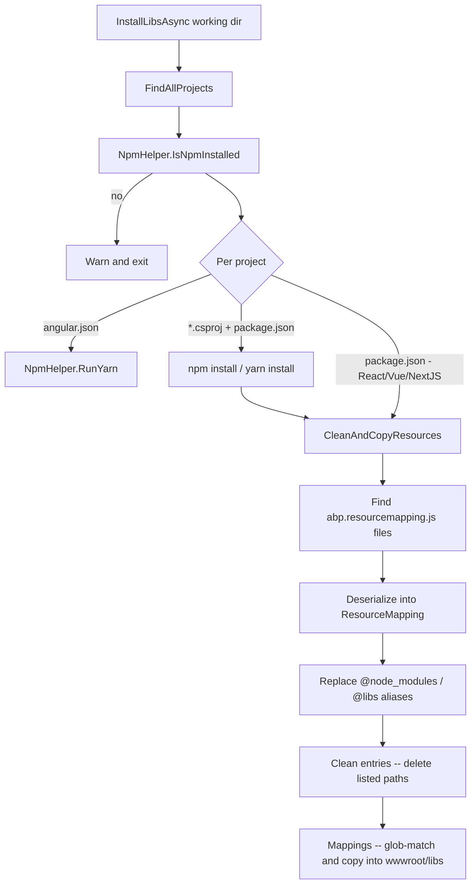

ABP MVC and Blazor Server applications keep their browser-side libraries (Bootstrap, jQuery, Datatables, etc.) under `wwwroot/libs/`. Those files come from `node_modules`, but only a curated subset is exposed to the browser. `abp install-libs` is the command that performs that copy step. Source under `framework/src/Volo.Abp.Cli.Core/Volo/Abp/Cli/LIbs/` (the folder name uses uppercase `I` to keep its existing namespace).

## Command shape

```bash
abp install-libs
  -wd|--working-directory <directory-path>   (default: current)
```

`InstallLibsCommand` (`framework/src/Volo.Abp.Cli.Core/Volo/Abp/Cli/Commands/InstallLibsCommand.cs`) hands off to `IInstallLibsService.InstallLibsAsync(workingDirectory)`.

## What the service does

`InstallLibsService` (`LIbs/InstallLibsService.cs`) walks the directory tree and processes every project it finds (excluding `node_modules`, `.git`, `.idea`, `_templates`, `bin/debug`, `obj/debug`):



### Project detection

`FindAllProjects` returns:

- every `angular.json` it finds → treated as an Angular workspace, runs `yarn` only;
- every `*.csproj` that has a sibling `package.json` → MVC/Blazor host, runs `npm install` then copies libs;
- every `package.json` whose `DetectFrameworkTypeFromPackageJson` resolves to `React`/`ReactNative`/`Vue`/`NextJs` → runs the framework's install command.

### abp.resourcemapping.js

The actual copy plan lives in each project at `abp.resourcemapping.js` — a JavaScript file that simply exports a `ResourceMapping` literal. The service strips `module.exports =` / trailing `;` and deserialises the rest as JSON:

```js abp.resourcemapping.js (example shape)
module.exports = {
  aliases: {
    "@node_modules": "./node_modules",
    "@libs":         "./wwwroot/libs"
  },
  clean: [ "@libs" ],
  mappings: {
    "@node_modules/bootstrap/dist/**/*":   "@libs/bootstrap/",
    "@node_modules/jquery/dist/jquery.js": "@libs/jquery/jquery.js"
  }
};
```

`ResourceMapping` (`LIbs/ResourceMapping.cs`) carries three dictionaries — `Aliases`, `Clean`, `Mappings`. `ReplaceAliases()` substitutes the `@node_modules`/`@libs` tokens with real paths so the rest of the pipeline can use them verbatim. The defaults:

```csharp framework/src/Volo.Abp.Cli.Core/Volo/Abp/Cli/LIbs/ResourceMapping.cs
Aliases = new Dictionary<string, string>
{
    {"@node_modules", "./node_modules"},
    {"@libs",         "./wwwroot/libs"}
};
```

### Clean and copy

`CleanAndCopyResources` (`LIbs/InstallLibsService.cs`) first calls `CleanDirsAndFiles` to delete every path in the merged `Clean` list (including the default `./wwwroot/libs`), then `CopyResourcesToLibs` walks `Mappings`. Each key is a glob; `Microsoft.Extensions.FileSystemGlobbing.Matcher` resolves it against `node_modules/`, and `FileMatchResult` (`LIbs/FileMatchResult.cs`) carries the matched path plus its glob "stem" so subdirectory structure is preserved when the destination is a folder.

The destination directory is created if it does not exist (`EnsureLibsFolderExists`).

## When it runs automatically

`abp new` invokes `install-libs` after generating an MVC/Blazor solution unless `-sib/--skip-installing-libs` is passed (see `NewCommand`). You also need to re-run it after editing `abp.resourcemapping.js`, after adding modules that bring new client-side libraries, or after pulling someone else's changes that touched `package.json`.

If `npm` is missing the service logs a warning and exits cleanly:

```text
NPM is not installed, visit https://nodejs.org/en/download/ and install NPM
```

<CardGroup cols={2}>
  <Card title="Bundling" href="/tooling/bundling">Companion command for Blazor WebAssembly bundles.</Card>
  <Card title="CLI commands" href="/tooling/cli-commands">All built-in CLI verbs.</Card>
</CardGroup>
