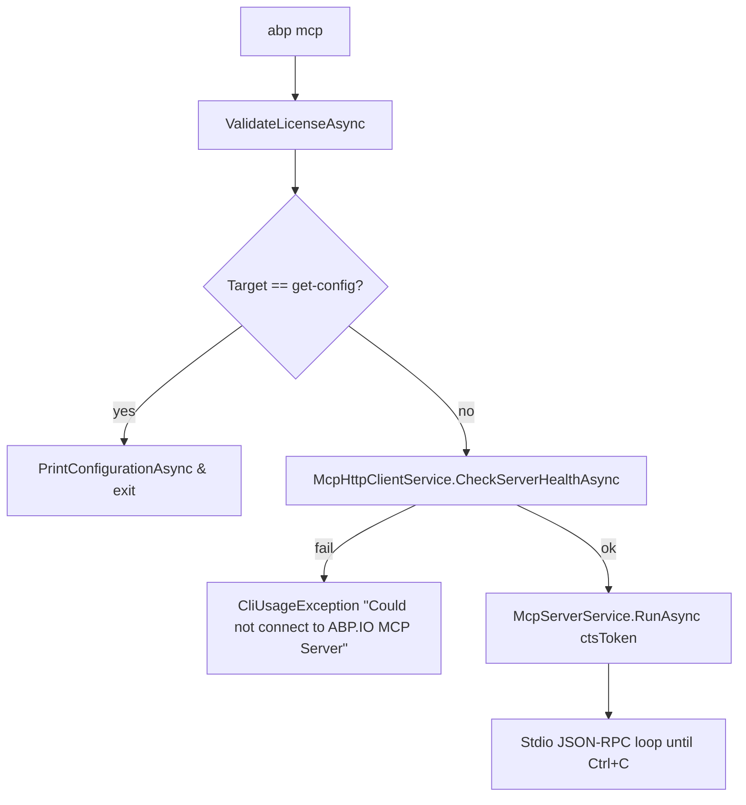

The `mcp` command turns the CLI process into a Model Context Protocol server. AI clients (Claude Desktop, Cursor, VS Code MCP, etc.) launch it as a child process and talk to it over stdio JSON-RPC, which is why the CLI takes special care not to write anything else to stdout when this command is selected.

## Usage

```bash
abp mcp              # start the local MCP server (long-running, reads stdio)
abp mcp get-config   # print MCP client configuration as JSON and exit
```

`McpCommand` (`framework/src/Volo.Abp.Cli.Core/Volo/Abp/Cli/Commands/McpCommand.cs`) registers under the name `"mcp"` and is bound in `AbpCliCoreModule.ConfigureServices`.

## Boot path quirks

Because the protocol is JSON-RPC over stdout, `Program.Main` switches its Serilog sink before starting the application:

```csharp framework/src/Volo.Abp.Cli/Volo/Abp/Cli/Program.cs
if (args.Length > 0 && args[0].Equals("mcp", StringComparison.OrdinalIgnoreCase))
{
    Log.Logger = config
        .WriteTo.File(Path.Combine(CliPaths.Log, "abp-cli-mcp-logs.txt"), ...)
        .CreateLogger();   // file-only — NO console sink
}
```

`CliService.RunAsync` also skips the `ABP CLI x.y.z` banner and the version-check call when `commandLineArgs.IsMcpCommand()` returns true, and any `CliUsageException`/fatal error is routed through `IMcpLogger` (a dedicated stderr writer) instead of `ILogger` to keep the JSON-RPC stream clean.

## What the command does



Key collaborators (resolved through the CLI's DI container):

| Service | File | Role |
| --- | --- | --- |
| `AuthService` | `Auth/AuthService.cs` | Re-uses the same login session as `abp login`. |
| `IApiKeyService` | `Licensing/...` | Validates the user's ABP license / API key. |
| `McpHttpClientService` | `Commands/Services/` | Talks to `https://...abp.io` to fetch tool definitions / health-check. |
| `McpServerService` | `Commands/Services/` | Runs the actual MCP server loop (transport + dispatch). |
| `IMcpLogger` | `Commands/Services/` | Stderr-only logger that never corrupts stdout. |
| `ITelemetryService` | `Internal/Telemetry/` | Wraps the run in `ActivityNameConsts.AbpCliCommandsMcp`. |

The server cannot start in offline mode: `CheckServerHealthAsync` must succeed because tool definitions are fetched remotely. Ctrl+C is handled by a `ConsoleCancelEventHandler` that cancels the `CancellationTokenSource` passed to `RunAsync`, then `cts.Dispose()` runs in `finally`.

`abp mcp get-config` writes the recommended client configuration JSON (server name, command, args) so users can paste it into a Claude Desktop, Cursor, or VS Code MCP config file.

<Card title="CLI commands" href="/tooling/cli-commands">Full command reference.</Card>
