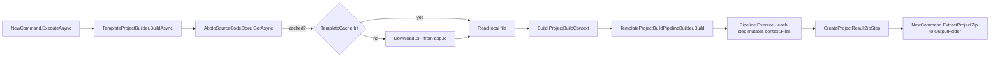

`abp new` does not run a shell template engine. Instead, the CLI downloads a versioned ZIP, treats every file as a `FileEntry` in memory, and applies an ordered list of `ProjectBuildPipelineStep` instances that rename projects, swap database providers, prune unused folders, and replace placeholders. The whole machinery lives in `framework/src/Volo.Abp.Cli.Core/Volo/Abp/Cli/ProjectBuilding/`.

## High-level flow



## Source code store and caching

`ISourceCodeStore` is implemented by `AbpIoSourceCodeStore` (`framework/src/Volo.Abp.Cli.Core/Volo/Abp/Cli/ProjectBuilding/AbpIoSourceCodeStore.cs`). It resolves the latest version via the abp.io HTTP API (or accepts an explicit `-v` value), then either returns a cached `TemplateFile` or downloads a fresh ZIP. The cache lives at `CliPaths.TemplateCache`; the `--skip-cache` switch on `abp new` forces a re-download. `AbpCliOptions.CacheTemplates` (default `true`) is the global on/off switch.

The store handles three `SourceCodeTypes`: `Template`, `Module`, and `NugetPackage`. Templates are downloaded as `.zip`; modules and packages have parallel `ModuleProjectBuilder` / `NugetPackageProjectBuilder` paths declared next to `TemplateProjectBuilder`.

## ProjectBuildArgs and ProjectBuildContext

`NewCommand` packages the parsed CLI flags into a `ProjectBuildArgs` (template name, version, UI framework, database provider, theme, mobile, extra properties dictionary, etc.). `TemplateProjectBuilder.BuildAsync` then constructs a `ProjectBuildContext` (`ProjectBuilding/Building/ProjectBuildContext.cs`) carrying:

- the resolved `TemplateInfo` (`AppTemplate`, `ModuleTemplate`, `ConsoleTemplate`, `MauiTemplate`, `WpfTemplate`, …);
- the downloaded `TemplateFile` and its in-memory `FileEntryList`;
- a `ProjectResult` slot that gets populated with the final ZIP bytes;
- a `Symbols` list used to flag feature combinations during step execution.

`FileEntry` (`ProjectBuilding/Files/FileEntry.cs`) is the unit every step works on — it carries the relative path, raw bytes, and helpers like `SetContent`, `NormalizeText`, and `IsDirectory`. `FileEntryList` adds convenience methods (`GetFileByName`, `RemoveAll(pattern)`, etc.) that steps lean on heavily.

## The pipeline

`TemplateProjectBuildPipelineBuilder.Build` (`ProjectBuilding/Building/TemplateProjectBuildPipelineBuilder.cs`) constructs the ordered step list. The shared backbone is:

```csharp framework/src/Volo.Abp.Cli.Core/Volo/Abp/Cli/ProjectBuilding/Building/TemplateProjectBuildPipelineBuilder.cs
pipeline.Steps.Add(new FileEntryListReadStep());                  // unzip → FileEntryList
if (version > 4.3.99) pipeline.Steps.Add(new CreateAppSettingsSecretsStep());
pipeline.Steps.AddRange(context.Template.GetCustomSteps(context));// per-template steps
pipeline.Steps.Add(new ProjectReferenceReplaceStep());
pipeline.Steps.Add(new TemplateCodeDeleteStep());
pipeline.Steps.Add(new SolutionRenameStep());
if (context.Template.IsPro()) pipeline.Steps.Add(new LicenseCodeReplaceStep());
// template-specific DBMS swap (App / AppNoLayers / Module)
// optional RemoveRootFolderStep for non-tiered MVC/Blazor
pipeline.Steps.Add(new CheckRedisPreRequirements());
pipeline.Steps.Add(new CreateProjectResultZipStep());
```

`ProjectBuildPipeline.Execute()` simply iterates the steps and calls `step.Execute(Context)` — no parallelism, no rollback. Steps are pure data transforms on `context.Files`.

### Step catalogue

The shared steps under `ProjectBuilding/Building/Steps/` cover the heavy lifting:

| Step | Purpose |
| --- | --- |
| `FileEntryListReadStep` | Unzip the template into `context.Files`. |
| `ProjectRenameStep` / `SolutionRenameStep` / `SolutionRenamer` | Replace `MyCompanyName.MyProjectName` with the user's name everywhere. |
| `ProjectReferenceReplaceStep` | Swap `ProjectReference`s to NuGet `PackageReference`s (unless `--local-framework-ref`). |
| `TemplateCodeDeleteStep` | Delete `#region template-code` blocks marked for removal. |
| `DatabaseManagementSystemChangeStep` | Replace EF Core provider strings (`UseSqlServer`/`UseMySql`/…) per `--dbms`. |
| `AppTemplateSwitchEntityFrameworkCoreToMongoDbStep` | Swap `EntityFrameworkCore` projects for `MongoDB` ones when `-d mongodb`. |
| `RemoveProjectFromSolutionStep`/`Tye`/`Prometheus` | Surgical removals of projects the chosen options don't need. |
| `MoveFolderStep` / `MoveFileStep` / `RemoveRootFolderStep` | Reshape the on-disk layout (e.g. flatten non-tiered solutions). |
| `ChangeThemeStep` / `ChangeThemeStyleStep` | Apply `--theme`. |
| `RandomizeAuthServerPassPhraseStep` / `RandomizeStringEncryptionStep` / `TemplateRandomSslPortStep` | Replace template defaults with per-solution random secrets/ports. |
| `ConnectionStringChangeStep` | Apply `--connection-string`. |
| `CreateProjectResultZipStep` | Re-zip the mutated `FileEntryList` into `context.Result.ZipContent`. |

Per-template overrides (`Templates/App/*.cs`, `Templates/Module/*.cs`, `Templates/Maui/*.cs`, `Templates/Wpf/*.cs`, `Templates/Microservice/*.cs`) inject template-specific steps via `TemplateInfo.GetCustomSteps`. For example `AppTemplateBase` (`Templates/App/AppTemplateBase.cs`) calls `ConfigureTenantSchema`, `SwitchDatabaseProvider`, `DeleteUnrelatedProjects`, `ConfigureTieredArchitecture`, and `ConfigureTheme` in sequence.

## Events and analytics

Two events are published through `ILocalEventBus` during the build:

- `ProjectCreationProgressEvent` (`ProjectBuilding/Events/ProjectCreationProgressEvent.cs`) — emitted at major checkpoints ("Downloading the solution template", etc.) so hosts like ABP Studio can show a progress indicator.
- `ProjectPostRequirementsCheckedEvent` — fired after `CheckCreatingRequirements` validates prerequisites.

Anonymous analytics are sent through `ICliAnalyticsCollect` (`ProjectBuilding/Analyticses/CliAnalyticsCollect.cs`) to `https://abp.io/...` so the team can see which templates and DBMS choices are popular. The collector is best-effort: failures are swallowed.

## Output

`CreateProjectResultZipStep` packs the mutated file list into a ZIP. Back in `NewCommand.ExecuteAsync`, `ExtractProjectZip` writes it to the `--output-folder`, then `NewCommand` chains optional post-steps: `dotnet ef migrations`, `abp install-libs`, and `abp bundle` (each skippable through CLI flags).

<CardGroup cols={2}>
  <Card title="Project modification" href="/tooling/project-modification">How `add-package` / `add-module` mutate an existing solution.</Card>
  <Card title="Template catalogue" href="/templates/overview">The actual templates the pipeline operates on.</Card>
</CardGroup>
