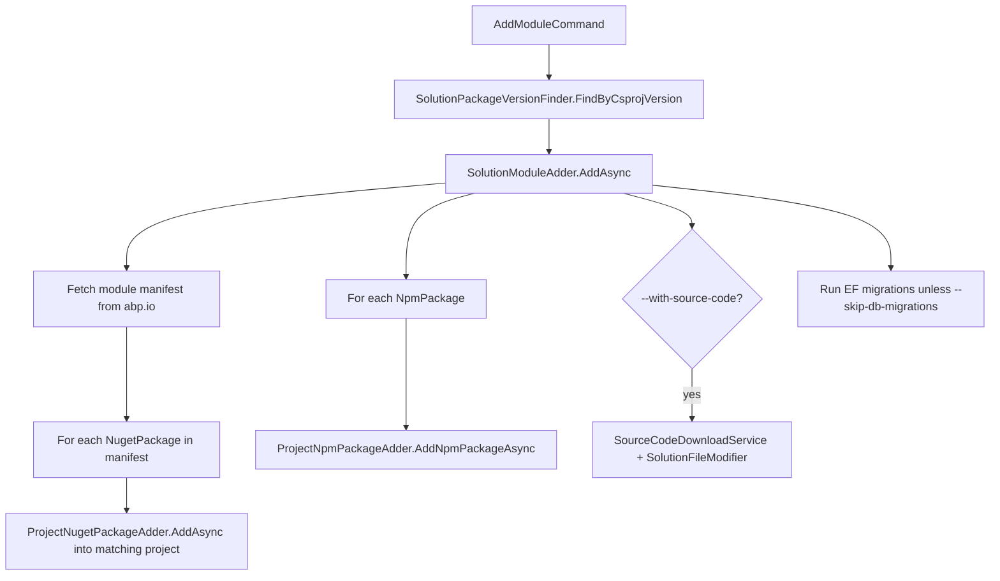

`abp new` builds a brand-new solution; the family of commands under `framework/src/Volo.Abp.Cli.Core/Volo/Abp/Cli/ProjectModification/` is what mutates a solution that already exists on disk. They are used by `add-package`, `add-module`, `update`, `switch-to-*`, and indirectly by `new` when it converts a freshly generated solution to use local framework references.

## Adding a NuGet package

`ProjectNugetPackageAdder` (`ProjectModification/ProjectNugetPackageAdder.cs`) is the workhorse behind `abp add-package`. The shape of `AddPackageCommand.ExecuteAsync` is:

```csharp framework/src/Volo.Abp.Cli.Core/Volo/Abp/Cli/Commands/AddPackageCommand.cs
await ProjectNugetPackageAdder.AddAsync(
    GetSolutionFile(commandLineArgs),
    GetProjectFile(commandLineArgs),
    commandLineArgs.Target,          // package id, e.g. Volo.Abp.Identity
    version,
    true,                            // useDotnetCli
    withSourceCode,
    addSourceCodeToSolutionFile);
```

Inside, the adder does five things:

1. **Resolve the project file.** If `-p/--project` was not passed, `ProjectFinder` scans for `.csproj` files next to the working directory.
2. **Look up the package metadata** through the abp.io HTTP endpoint (returned by `INugetPackageInfoProvider`) — this gives the module class name, namespace, and target type (`Default`/`Domain`/`Web`/…).
3. **Insert `<PackageReference>`** with the resolved version into the project's `.csproj` via direct XML editing (no `dotnet add package` shell-out).
4. **Edit the module class** via `DerivedClassFinder` + `ModuleClassDependcyAdder` — find the `AbpModule`-derived class in the same project, add the corresponding `using` and `[DependsOn(typeof(...))]` attribute.
5. **Optionally import source code.** When `--with-source-code` is set the adder calls `SourceCodeDownloadService` (under `Commands/Services/`) to fetch the module's source ZIP, extract it, and — if `--add-to-solution-file` is also set — register the projects in the `.sln` via `SolutionFileModifier`.

NPM packages go through `ProjectNpmPackageAdder` (`ProjectModification/ProjectNpmPackageAdder.cs`) instead. `AddPackageCommand` chooses based on the package name: anything starting with `@` is treated as an Angular/NPM package.

## Adding a whole module

`abp add-module` does more than add a single package: a module typically ships as a family of NuGet packages (`*.Domain`, `*.Application`, `*.Web`, `*.EntityFrameworkCore`, ...) plus optional Angular packages. `SolutionModuleAdder` (`ProjectModification/SolutionModuleAdder.cs`) orchestrates the multi-package install:



`SolutionPackageVersionFinder.FindByCsprojVersion` (`ProjectModification/SolutionPackageVersionFinder.cs`) walks the existing `PackageReference` entries to pick a default version that matches what is already installed — that way adding a module always tracks the user's ABP version. For `LeptonX` the finder falls back to `FindByDllVersion` because the LeptonX modules are versioned independently of the core framework.

`AbpCliOptions.DisabledModulesToAddToSolution` (configured in `AbpCliCoreModule`) blocks `add-module` for modules that intentionally cannot be installed this way (currently `Volo.Abp.LeptonXTheme.Pro` and `Volo.Abp.LeptonXTheme.Lite`).

## csproj and module-class editing

Several utility classes encapsulate the actual file edits:

| Class | File | What it edits |
| --- | --- | --- |
| `DerivedClassFinder` | `DerivedClassFinder.cs` | Find the class that extends `AbpModule` inside a project (used to know where to add `[DependsOn]`). |
| `ModuleClassDependcyAdder` | `ModuleClassDependcyAdder.cs` | Insert a `[DependsOn(typeof(XModule))]` attribute if not already present. |
| `UsingStatementAdder` | `UsingStatementAdder.cs` | Insert `using` directives idempotently. |
| `SolutionFileModifier` | `SolutionFileModifier.cs` | Add/remove `Project(...)` entries in `.sln`. |
| `ProjectFinder` / `ProjectFileNameHelper` | _(same names)_ | Locate the right csproj for a given module target (e.g. `*.Web` package goes into the project ending in `.Web`). |
| `PackageJsonFileFinder` | `PackageJsonFileFinder.cs` | Locate Angular `package.json` for NPM additions. |
| `NugetPackageToLocalReferenceConverter` / `LocalReferenceConverter` | _(same names)_ | Swap `PackageReference` for `ProjectReference` when `--with-source-code` or `switch-to-local` is used. |
| `VoloNugetPackagesVersionUpdater` | `VoloNugetPackagesVersionUpdater.cs` | Bulk-update versions of all `Volo.*` packages — backs `abp update`. |
| `PackagePreviewSwitcher` / `PackageSourceManager` | _(same names)_ | Implement `switch-to-preview`/`switch-to-nightly`/`switch-to-prerc` by rewriting `NuGet.Config` and version suffixes. |
| `NpmPackagesUpdater` | `NpmPackagesUpdater.cs` | Walk Angular projects and bump `@abp/*` and `@volo/*` packages. |
| `AngularPwaSupportAdder` / `AngularThemeConfigurer` / `AngularSourceCodeAdder` | _(same names)_ | Angular-side mutations triggered by add-module / theme switches. |
| `ThemePackageAdder` | `ThemePackageAdder.cs` | Replace the active theme package set across a multi-project solution. |
| `EfCoreMigrationManager` / `DbContextFileBuilderConfigureAdder` | _(same names)_ | Run `dotnet ef migrations add` after a module is added and wire up `builder.ConfigureXxx()` calls in the host `DbContext`. |

`Events/` carries `ProjectModificationProgressEvent`s emitted through `ILocalEventBus`, mirroring the progress notifications used during project creation.

## Local references

`abp switch-to-local --paths D:\github\abp` and `abp new --local-framework-ref --abp-path ...` share `NugetPackageToLocalReferenceConverter`: it scans every `PackageReference` in the solution whose id matches the framework/module conventions and rewrites it to a `ProjectReference` pointing at the matching `.csproj` under the local repo. This is invaluable when debugging the framework alongside an application.

<CardGroup cols={2}>
  <Card title="Project building" href="/tooling/project-building">How `new` produces the solution that these commands later mutate.</Card>
  <Card title="Command reference" href="/tooling/cli-commands">All commands that ride on this infrastructure.</Card>
</CardGroup>
