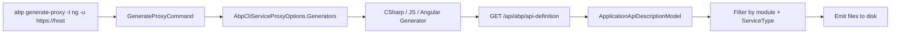

`abp generate-proxy` (and its inverse, `abp remove-proxy`) generates strongly typed client code that mirrors a running ABP backend's HTTP API. All generators share one trick: they fetch the JSON returned by `/api/abp/api-definition` and translate the resulting `ApplicationApiDescriptionModel` into language-specific files. The implementation lives in `framework/src/Volo.Abp.Cli.Core/Volo/Abp/Cli/ServiceProxying/`.

## Generator registration

Generators implement `IServiceProxyGenerator` (`ServiceProxying/IServiceProxyGenerator.cs`) and are registered in `AbpCliServiceProxyOptions` from `AbpCliCoreModule`:

```csharp framework/src/Volo.Abp.Cli.Core/Volo/Abp/Cli/AbpCliCoreModule.cs
Configure<AbpCliServiceProxyOptions>(options =>
{
    options.Generators[JavaScriptServiceProxyGenerator.Name] = typeof(JavaScriptServiceProxyGenerator); // "JS"
    options.Generators[AngularServiceProxyGenerator.Name]    = typeof(AngularServiceProxyGenerator);    // "NG"
    options.Generators[CSharpServiceProxyGenerator.Name]     = typeof(CSharpServiceProxyGenerator);     // "CSHARP"
});
```

`GenerateProxyCommand` parses `-t/--type` (`csharp`/`js`/`ng`), resolves the matching generator type from the dictionary, and calls `GenerateProxyAsync(GenerateProxyArgs)`. `RemoveProxyCommand` does exactly the same thing but signals removal via `args.CommandName`, so each generator can branch in one method.

## Shared base class

`ServiceProxyGeneratorBase<T>` (`ServiceProxying/ServiceProxyGeneratorBase.cs`) handles the network call:

```csharp framework/src/Volo.Abp.Cli.Core/Volo/Abp/Cli/ServiceProxying/ServiceProxyGeneratorBase.cs
var client = CliHttpClientFactory.CreateClient(needsAuthentication: false);
var apiDefinitionResult = await client.GetStringAsync(
    CliUrls.GetApiDefinitionUrl(args.Url, requestDto));
var apiDefinition = JsonSerializer.Deserialize<ApplicationApiDescriptionModel>(apiDefinitionResult);
```

`CliUrls.GetApiDefinitionUrl` (`framework/src/Volo.Abp.Cli.Core/Volo/Abp/Cli/CliUrls.cs`) just appends `api/abp/api-definition` (optionally with `?includeTypes=true`) to the user-provided `-u/--url`. The base class then narrows the response to a single module (`-m`) and filters controllers by `ServiceType.Application` vs `ServiceType.Integration` so that integration services and app services can be generated separately.



## C# generator

`CSharpServiceProxyGenerator` (`ServiceProxying/CSharp/CSharpServiceProxyGenerator.cs`) writes one C# file per controller into `ClientProxies/` (override with `--folder`). For each `IXxxAppService` discovered in the model, it emits a partial class that extends `ClientProxyBase<IXxxAppService>` and registers itself as the service implementation:

```csharp
[Dependency(ReplaceServices = true)]
[ExposeServices(typeof(IBookAppService), typeof(BookClientProxy))]
[IntegrationService]
public partial class BookClientProxy : ClientProxyBase<IBookAppService>, IBookAppService
{
    // RequestAsync(...) calls for each method
}
```

A companion `*.Part.cs` file is emitted so users can add hand-written code without losing it on regeneration. `--without-contracts` skips emitting the DTO/interface clones, which is what you want when the host already references the module's `*.Application.Contracts` assembly.

## JavaScript generator

`JavaScriptServiceProxyGenerator` (`ServiceProxying/JavaScript/JavaScriptServiceProxyGenerator.cs`) delegates the actual code emission to the framework's `JQueryProxyScriptGenerator` (`Volo.Abp.Http.ProxyScripting`). It writes the file to `wwwroot/client-proxies/<module>-proxy.js` by default, or to the path given by `-o/--output`:

```csharp framework/src/Volo.Abp.Cli.Core/Volo/Abp/Cli/ServiceProxying/JavaScript/JavaScriptServiceProxyGenerator.cs
var applicationApiDescriptionModel = await GetApplicationApiDescriptionModelAsync(args);
var script = RemoveInitializedEventTrigger(
    _jQueryProxyScriptGenerator.CreateScript(applicationApiDescriptionModel));
using (var writer = new StreamWriter(output))
{
    await writer.WriteAsync(script);
}
```

The generated script attaches functions like `volo.bookStore.books.getList(...)` to the global `abp.serviceProxies` object, calling `abp.ajax` under the hood.

## Angular generator

`AngularServiceProxyGenerator` (`ServiceProxying/Angular/AngularServiceProxyGenerator.cs`) is unusual: it does not generate code itself. Instead it shells out to `@abp/ng.schematics` via `npx`, passing the CLI options as schematics arguments:

```csharp
var commandBuilder = new StringBuilder("npx ng g @abp/ng.schematics:proxy-add");
// --module / --api-name / --source / --target / --url / --entry-point appended conditionally
```

That schematic reads the same `/api/abp/api-definition` endpoint and emits per-service Angular providers and DTO files inside the configured Angular project. `args.CommandName == RemoveProxyCommand.Name` flips the schematic to `proxy-remove`. The `-p/--prompt` flag lets the schematic ask the user interactively for any missing options instead of using the `__default` sentinel.

`CheckAngularJsonFile()` ensures the command is being run from inside an Angular workspace, and `CheckNgSchematicsAsync()` makes sure `@abp/ng.schematics` is installed before invoking it.

## Arguments

`GenerateProxyArgs` (`ServiceProxying/GenerateProxyArgs.cs`) is the canonical bag passed to every generator:

| Property | CLI flag | Used by |
| --- | --- | --- |
| `CommandName` | implicit | All (switches generate vs remove). |
| `WorkDirectory` | `-wd` | All. |
| `Module` | `-m/--module` (default `app`) | All. |
| `Url` | `-u/--url` | All. |
| `Output` | `-o/--output` | JS. |
| `Folder` | `--folder` (default `ClientProxies`) | C#. |
| `WithoutContracts` | `--without-contracts` | C#. |
| `ApiName`, `Source`, `Target`, `EntryPoint` | `-a`, `-s`, `--target`, `--entry-point` | Angular. |
| `ServiceType` | derived (Application vs Integration) | All. |
| `ExtraProperties` | passthrough | Angular `-p/--prompt`, etc. |

`remove-proxy` reuses the same flags so the two verbs feel symmetric.

<CardGroup cols={2}>
  <Card title="CLI commands" href="/tooling/cli-commands">Full option list for `generate-proxy` and `remove-proxy`.</Card>
  <Card title="Bundling" href="/tooling/bundling">The sibling command that finalises a Blazor build.</Card>
</CardGroup>
